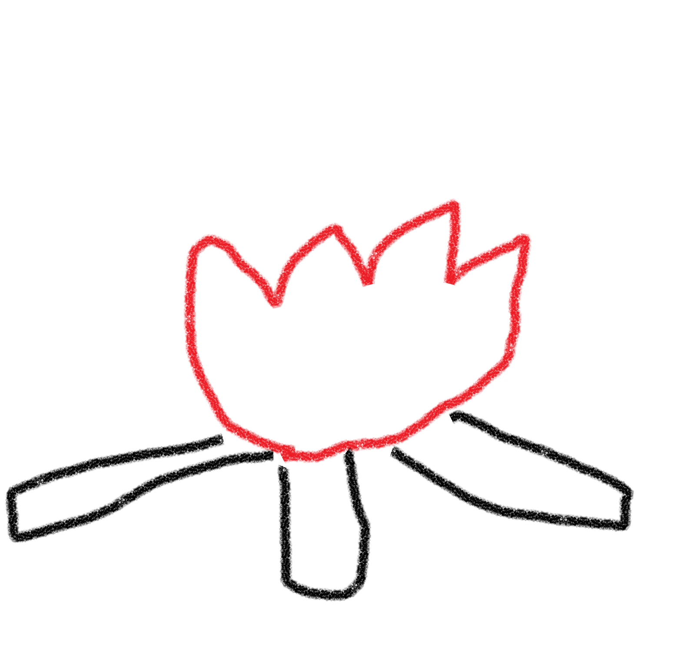

# 🔥nogolivi (残り火)🔥

> 残り火は適切に消火して、 **no "go" livi**ng へ。

A tool for visualizing goroutines that are not terminated when the main function terminates.

main 関数終了時に終了していない goroutine の可視化を行うツールです。

## 注意

Go 1.21 の runtime.Stack の仕様変更に依存しているため、現在は go1.21RC2 環境での動作としています。
